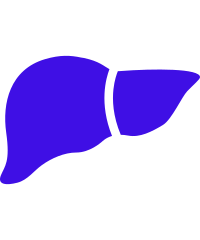

### Onkologie

| Columns-Predisposing-Factors |  |
|---|---|
| Bitte wählen Sie eine Indikation |  |
|  | **Hämatologie** |
|  | **Endometriumkarzinom** |
|  | **Lungenkarzinom** |
|  | **Mammakarzinom** |
|  | **Ovarialkarzinom** |
|  | **Hepatozelluläres Karzinom** |
|  | **Biliäre Karzinome** |
|  | **Uro-Onkologie** |

---

<!-- Content source: https://www.mein-medcampus.de/onkologie -->
<!-- Mapped: 2025-10-30 -->
<!-- Login required: yes -->
